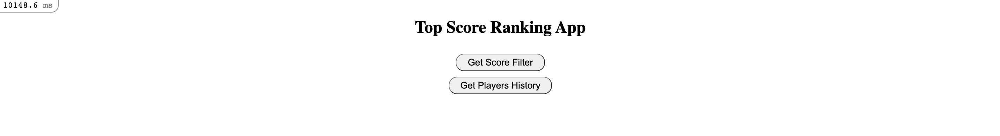
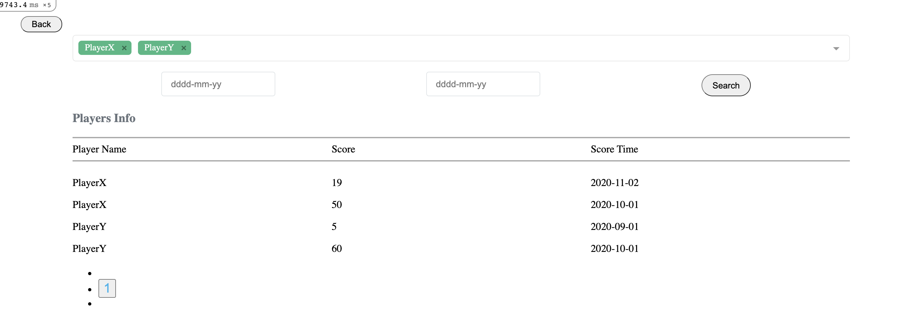
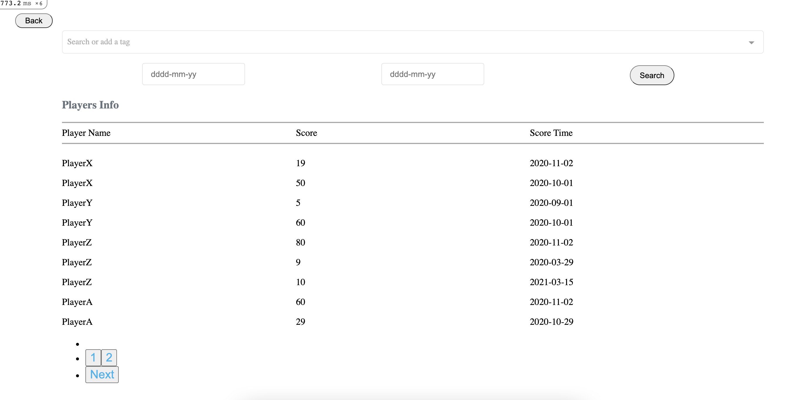
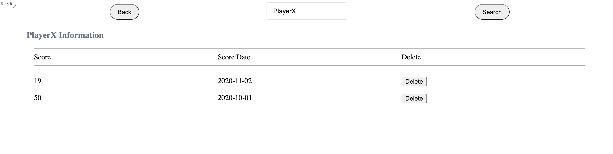

Top Score Ranking
===================
A Top Score Ranking to keep track of the players ranking, results an overall listing of players information. Built with Rails.

```
Key functionality includes the ability to:
- Score filters of player and ther History Tab
- Listing of all scroes of Player
- Show Player History Tab
```

Setup:
-------
```
git clone [url of repo]
bundle
bin/rake db:create
bin/rake db:migrate
bin/rake db:seed
bin/rails s

#to run tests
rspec
```

Technologies Used:
-------
```
- [Ruby On Rails](http://rubyonrails.org/)
- Tested using [RSpec](http://rspec.info/)
- [Vuejs] (https://vuejs.org/)
```

Screenshots:
-------
Sample - Laptop Resolution (Home Screen)



Sample - Laptop Resolution (Search using multiple players)



Sample - Laptop Resolution (Show list all players scroes)



* Note: If you don't pass any values it will return all records

Sample - Laptop Resolution (Players History Tab)

